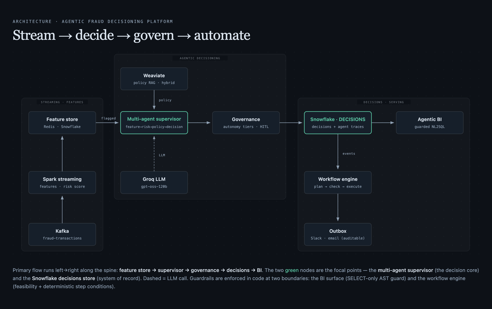

# Agentic Fraud Decisioning Platform

Real-time fraud decisioning built as one end-to-end system: **Kafka + Spark**
streaming features → **Redis** online store / **Snowflake** audit lake →
**RAG-grounded LangGraph agents** that decide ALLOW / BLOCK / ESCALATE →
**governance & human-in-the-loop** → **agentic BI** and a **natural-language
workflow engine** over the decision log.



*Interactive version: [`docs/architecture-diagram.html`](docs/architecture-diagram.html)
· the two green nodes are the focal points (the decision core and the system of
record); dashed = LLM call; guardrails are enforced in code at the BI surface and the
workflow engine.*

---

## What it is

An end-to-end demonstration of the data-engineering **and** agentic-AI surface a
production fraud system touches — ingestion, a feature store, a medallion-style
warehouse, retrieval-augmented reasoning, a multi-agent supervisor, autonomy
governance, an audit trail, evaluation, and a guarded analytics/automation layer —
running locally on Docker with synthetic data.

> **The story behind the code:** [`docs/index.html`](docs/index.html) is an
> interactive record of *how* this was built — the supervision loop between a human
> and an autonomous coding agent, the bugs found twice, the audit that contradicted
> an approval, and the metrics that lied. Companion pages: `docs/phases.html`,
> `docs/stack.html`, `docs/architecture.html`. Narrative source of truth:
> [`PROJECT_NARRATIVE.md`](docs/PROJECT_NARRATIVE.md).
> View locally: `python3 -m http.server 8710 --directory docs`.

---

## Why it matters

Fraud decisioning is where three hard requirements collide: it has to be **fast**
(a decision per transaction, in-line), **grounded** (a block must trace to a
documented policy, not a model's guess), and **auditable** (every decision and every
reasoning step has to survive a compliance review months later). Most demos show one
of those. This project's point is the **whole surface at once** — and specifically
the boundary that keeps an LLM useful without letting it become the authority:

- The agents *reason*, but **invariants live in code** — policy grounding is required
  before any decision; autonomy tiers come from asymmetric error costs, not vibes.
- The BI layer lets you ask questions in English, but the LLM is treated as an
  **untrusted SQL author** behind an AST guard.
- The workflow engine automates ops in plain English, but a plan can only touch
  **registered, read-only tools**, and feasibility is decided in code before anything
  runs.

That "**judgment from models, invariants from code**" split is the thesis; everything
below is an instance of it.

---

## How it works

A transaction is generated → streamed through **Kafka** → **Spark Structured
Streaming** computes fraud features (amount z-score, Haversine geo-distance,
sliding-window velocity, new-device flag, and a two-tier risk score) → features land
in **Redis** (online, 24h TTL) and **Snowflake** (offline audit). A flagged
transaction is handed to a **LangGraph agent** that reads the live features, retrieves
the relevant **fraud policy** from **Weaviate**, checks the user's baseline, and
returns a decision grounded in documented policy. **Governance** decides *how much
autonomy* that decision gets (auto-approve / notify / queue for a human), persists it,
and writes a full reasoning trace. An **LLM-judge eval** scores outcomes and reasoning;
a **guarded NL2SQL BI** layer and a **natural-language workflow engine** sit on top of
the decision log.

### Two agent architectures, side by side
- A single **ReAct** agent — one model, three tools, an explicit `StateGraph` loop
  with a step cap.
- A **multi-agent supervisor** — an LLM router over four focused specialists on a
  typed blackboard, with invariants enforced in code (e.g. *policy grounding is
  required before any decision*).

### Tech stack

| Tool | Role in this system |
|------|---------------------|
| **Apache Kafka** (KRaft) | Transaction transport; keyed by `user_id` so per-user aggregation is shuffle-friendly |
| **Spark Structured Streaming** | Feature computation in micro-batches (z-score, geo, velocity, device, risk) |
| **Redis** | Online feature store the agents read (24-hour TTL) |
| **Snowflake** | System of record — `DIM` / `RAW` / `FEATURES` / `DECISIONS` schemas + audit trail |
| **S3 + Snowpipe** | Buffered Parquet → auto-ingest offline write path (with a direct-write fallback) |
| **Weaviate** | Hybrid-search vector store over the fraud-policy corpus (RAG) |
| **sentence-transformers** | `all-MiniLM-L6-v2` embeddings (local, CPU, 384-dim) |
| **LangGraph** | The agent runtime — explicit `StateGraph`s (ReAct loop + supervisor + plan-and-execute) |
| **Groq** | LLM inference — `openai/gpt-oss-120b` for agents & NL2SQL; an independent `qwen/qwen3.6-27b` as the eval judge |
| **sqlglot** | AST-based SQL guard for the NL2SQL surface |
| **Streamlit / FastAPI** | BI dashboard, the Workflows page, and the workflow API |
| **Docker Compose** | Local orchestration of Kafka, Spark, Redis, Weaviate |

### Where the code lives

One installable package, `fraud_platform`:

| Area | Package | What it does |
|------|---------|--------------|
| Streaming features | `stream_processing` | Spark feature engine, velocity engine, hard-rule + weighted scoring |
| Data generation | `data_generator` | Synthetic users/devices/transactions with injectable fraud |
| Retrieval (RAG) | `retrieval` | Weaviate hybrid search over fraud policy docs |
| Single agent | `agents.single_agent` | ReAct agent + its 3 tools |
| Multi-agent | `agents.multi_agent` | Supervisor orchestrator + 4 specialists |
| Governance / HITL | `governance` | Autonomy tiers, decision persistence, review queue |
| Observability / eval | `observability` | Trace writer, LangSmith, eval + LLM judge |
| BI dashboard | `bi_dashboard` | Guarded NL2SQL over the audit log (Streamlit) |
| Workflow engine | `workflow_engine` | Plan-and-execute NL automation (planner → feasibility → executor) |
| DB tooling | `db` | Schema contract, validators, migration runner, replay MERGE |

Config is one typed, validated object: `fraud_platform.settings.get_settings()`.
Credentials come from `.env` at the repo root (git-ignored).

### Run it

Assumes repo root as the working directory and the virtualenv activated
(`source venv/bin/activate`), or prefix commands with `./venv/bin/`.

```bash
# 1. Install
python3.10 -m venv venv && source venv/bin/activate
pip install -e ".[rag,agents,bi,dev,workflow]"     # local dev (any OS)
cp .env.example .env                                # then fill in credentials

# 2. Infra
docker compose up -d          # Kafka, Spark, Redis, Weaviate, Kafka UI

# 3. Database — run these THREE in order (order matters):
#   snowflake/schema.sql  → snowflake/rbac.sql  → fraud-migrate
#   (rbac.sql must precede migrations: V002/V004 grant to roles it creates)
fraud-migrate --dry-run       # show pending migrations, apply nothing
fraud-migrate                 # apply idempotently

# 4. Seed + run the pipeline
python -m fraud_platform.data_generator.user_profile_generator
python -m fraud_platform.data_generator.transaction_stream_generator --backfill --num 25000
python -m fraud_platform.stream_processing.feature_engine

# 5. Demos (hit real Redis/Snowflake/Weaviate/Groq — not mocked)
python -m fraud_platform.agents.multi_agent.run_demo         # multi-agent orchestration
python -m fraud_platform.governance.run_demo                 # decide → tier → persist → review
python -m fraud_platform.observability.eval_runner           # eval + LLM judge
streamlit run fraud_platform/bi_dashboard/streamlit_app.py   # BI dashboard
```

For a **reproducible / CI install**, pin to the locked resolution
(`pip install -c constraints.txt … --extra-index-url https://download.pytorch.org/whl/cpu`);
`constraints.txt` is the Linux/CI lock (CPU torch). The unit test suite needs no
credentials; only the demos touch live services.

---

## One example, end to end

**A flagged $4,200 transaction from a new device, 900 km from the user's usual
location.**

1. **Stream → features.** Kafka delivers the txn; Spark computes an amount z-score of
   3.1, a Haversine distance of 900 km, a velocity of 4 txns/10 min, and a
   `new_device` flag → a two-tier risk score that trips the "flagged" threshold.
   Features are written to Redis (online) and Snowflake (audit).
2. **Retrieve policy.** The multi-agent supervisor routes to its specialists. The
   **policy agent** does a hybrid search in Weaviate and pulls the *velocity + new
   device* rule — grounding is a code-enforced precondition, so the decision **cannot**
   proceed without a cited policy.
3. **Decide.** The **decision agent** returns `ESCALATE` with a reasoning trace that
   cites the retrieved rule and the specific features that triggered it.
4. **Govern.** Because the asymmetric error cost of a false ALLOW here is high,
   governance assigns the **queue-for-human** autonomy tier rather than auto-acting.
   The decision row is written *born complete* with its tier; the reasoning trace lands
   in `FACT_AGENT_TRACES`.
5. **Automate (optional).** A fraud-ops user has a standing workflow: *"after every
   payment capture, if the user has 2+ BLOCK decisions in 24h, Slack their history."*
   The planner decomposes it, feasibility passes in code, and on the next event the
   guarded step count fires — or **skips deterministically** when the guard is false,
   leaving the outbox empty. Ask *"delete all BLOCK decisions"* instead and the
   planner + feasibility check **reject** it, because no destructive tool exists. That
   refusal *is* the guardrail demo:

   ```bash
   python -m fraud_platform.workflow_engine.run_demo --mock   # end-to-end, no infra
   ```

---

## Safety & guardrails

Every place an LLM output could cause an effect, a code-level boundary sits in front
of it:

- **Least privilege in the warehouse** — separate Snowflake roles per access domain
  (`PIPELINE_ROLE` / `AGENT_ROLE` / `BI_ROLE`), with secondary roles confined so an
  operator's admin grant can't silently ride along. No application path defaults to
  ACCOUNTADMIN.
- **Untrusted-SQL BI** — English → SQL via an LLM, but a sqlglot **AST validator**
  enforces a SELECT-only, table-allowlisted, single-statement boundary before anything
  reaches Snowflake.
- **Governance is a state machine, not a prompt** — autonomy tiers and the
  human-in-the-loop gate are code transitions; atomic review updates prevent
  double-review races.
- **Workflow feasibility in code** — a plan can only reference **registered, read-only**
  tools; an unknown or destructive tool is a feasibility *failure caught in code*, not
  a prompt hope. Step guards (`when: "$step_1.count >= 2"`) are evaluated in Python,
  never by the model — a false guard **skips** the step (and cascades to its
  dependents) rather than fanning out an unwanted effect.
- **Auditable side effects** — NOTIFY connectors write to an **outbox** row (the
  artifact) unless a real Slack webhook is configured. Every step is persisted before
  the next begins, and execution **stops on the first failure** — no fail-open.

---

## Evaluation

Decisions are scored two ways, kept independent so neither grades its own homework:

- **Objective metrics** against synthetic ground truth — precision / recall / FPR / F1,
  plus **calibration** (Brier) and **multi-pattern detection** (was the anomaly
  *detected*, correctly *identified*, *mislabeled*, or *missed* — scored as separate
  buckets so a detected-but-mislabeled case isn't counted as a total miss).
- **An independent LLM judge** — a **different model family** (`qwen/qwen3.6-27b`, vs
  the `gpt-oss` agents) scores reasoning quality in JSON-object mode with local Pydantic
  validation. Judge failures are **isolated and non-fatal**: the objective fraud metrics
  still count and the batch continues, so one bad judge call can't sink a run.

Every reasoning step is persisted to `FACT_AGENT_TRACES`; human review verdicts
accumulate as labeled eval data over time.

---

## Limitations (honest scope)

- **Synthetic data, portfolio project** — not a deployed commercial fraud system.
- **Small eval samples** — as few as a handful of transactions per run; **no
  statistical confidence** is claimed, and the docs don't imply otherwise.
- **Geo hard-rule** — investigated and *meaningfully improved* (over-flagging cut from
  ~44% toward ~26%), **not** declared fully solved. See
  [`GEO_FLAGGING_INVESTIGATION.md`](docs/GEO_FLAGGING_INVESTIGATION.md).
- **The workflow engine simulates the edges** — webhooks are a `POST /events/{type}`
  stand-in; Slack/email are demo connectors (outbox is the artifact unless
  `SLACK_WEBHOOK_URL` is set); persistence is SQLite. The state machine, planner, and
  feasibility checks are real; the named production gaps (OAuth lifecycle, Postgres) are
  called out in the code.
- **Not everything an autonomous agent reported as "done" survived scrutiny** — several
  rounds needed correction after independent verification. That process is documented
  deliberately in [`PROJECT_NARRATIVE.md`](docs/PROJECT_NARRATIVE.md), not hidden.
