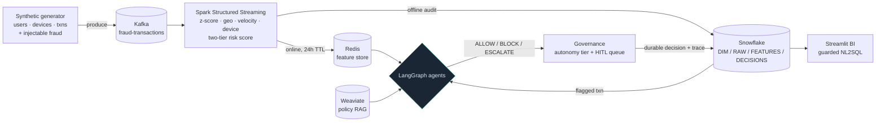

# Agentic Fraud Decisioning Platform

Real-time fraud decisioning built as a full data + AI pipeline: **Kafka + Spark**
streaming features → **Redis** online store / **Snowflake** audit lake →
**RAG-grounded LangGraph agents** that decide ALLOW / BLOCK / ESCALATE →
**governance & human-in-the-loop** → **agentic BI** (natural-language SQL) over the
decision log.

It is an end-to-end demonstration of the data-engineering and agentic-AI surface a
production fraud system touches — ingestion, a feature store, a medallion-style
warehouse, retrieval-augmented reasoning, a multi-agent supervisor, autonomy
governance, an audit trail, evaluation, and a guarded analytics layer — running
locally on Docker with synthetic data.

> **The story behind the code:** [`docs/index.html`](docs/index.html) is an
> interactive, single-page record of *how* this was built — the supervision loop
> between a human and an autonomous coding agent, the bugs found twice, the audit
> that contradicted an approval, and the metrics that lied. Companion pages:
> `docs/phases.html` (what/why per phase), `docs/stack.html` (each tool's role),
> `docs/architecture.html` (the LangGraph graphs, clickable). Narrative source of
> truth: [`PROJECT_NARRATIVE.md`](docs/PROJECT_NARRATIVE.md).
> View locally: `python3 -m http.server 8710 --directory docs`.

> **Scope & honesty:** this is a learning / portfolio project on **synthetic data**,
> not a deployed commercial system. Evaluation samples have been small, so no
> statistical confidence is claimed. See [Caveats](#honest-caveats).

---

## What it does, end to end



A transaction is generated → streamed through Kafka → Spark computes fraud features
(amount z-score, Haversine geo-distance, sliding-window velocity, new-device flag,
and a two-tier risk score) → features land in Redis (online) and Snowflake (audit).
A flagged transaction is handed to a **LangGraph agent** that reads the live
features, retrieves the relevant **fraud policy** from a vector store, checks the
user's baseline, and returns a decision grounded in documented policy. **Governance**
then decides *how much autonomy* that decision gets (auto-approve / notify / queue
for a human), persists it, and writes a full reasoning trace. An **LLM-judge eval**
scores outcomes and reasoning, and a **guarded natural-language BI** layer answers
questions over the decision log.

---

## Highlights

- **Streaming feature engine** — Spark Structured Streaming with event-time windows;
  Redis online store (N+1 fixed with `MGET`) + Snowflake offline audit. Two-tier
  scoring: weighted signals *plus* hard-rule single-signal overrides.
- **Two agent architectures, side by side** — a single **ReAct** agent (one model,
  three tools, an explicit `StateGraph` loop with a step cap) and a **multi-agent
  supervisor** (an LLM router over four focused specialists on a typed blackboard,
  with invariants enforced in code — e.g. *policy grounding is required before any
  decision*).
- **RAG-grounded decisions** — Weaviate hybrid (keyword + vector) search over
  authored fraud-policy docs; the agent must cite documented policy, not general
  knowledge.
- **Governance & HITL** — decisions map to autonomy tiers from asymmetric error
  costs; a single owner writes every decision row *born complete* with its tier;
  human verdicts accumulate as labeled eval data. Atomic review updates prevent
  double-review races.
- **Observability & evaluation** — every reasoning step persisted to
  `FACT_AGENT_TRACES`; an eval runner scores decision accuracy against synthetic
  ground truth *and* reasoning quality via an independent LLM judge, with
  precision/recall/FPR/calibration metrics.
- **Guarded agentic BI** — English → SQL via an LLM, but the LLM is treated as an
  **untrusted SQL author**: an AST validator (sqlglot) enforces a SELECT-only,
  table-allowlisted, single-statement boundary before anything reaches Snowflake.
- **Least-privilege by design** — separate Snowflake roles per access domain
  (`PIPELINE_ROLE` / `AGENT_ROLE` / `BI_ROLE`), with secondary roles confined so an
  operator's admin grant can't silently ride along.
- **Engineered like production** — installable package, typed & validated settings,
  versioned idempotent migrations, a schema contract, resilience (retries / timeouts
  / circuit breakers / per-transaction isolation), a locked dependency set, and CI
  (lint, type-check, security scan, tests).

---

## Tech stack

| Tool | Role in this system |
|------|---------------------|
| **Apache Kafka** (KRaft) | Transaction transport; keyed by `user_id` so per-user aggregation is shuffle-friendly |
| **Spark Structured Streaming** | Feature computation in micro-batches (z-score, geo, velocity, device, risk) |
| **Redis** | Online feature store the agents read (24-hour TTL) |
| **Snowflake** | System of record — `DIM` / `RAW` / `FEATURES` / `DECISIONS` schemas + audit trail |
| **S3 + Snowpipe** | Buffered Parquet → auto-ingest offline write path (with a direct-write fallback) |
| **Weaviate** | Hybrid-search vector store over the fraud-policy corpus (RAG) |
| **sentence-transformers** | `all-MiniLM-L6-v2` embeddings (local, CPU, 384-dim) |
| **LangGraph** | The agent runtime — explicit `StateGraph`s (ReAct loop + supervisor) |
| **Groq** | LLM inference (`llama-3.3-70b-versatile`) for agents, judge, and NL2SQL |
| **sqlglot** | AST-based SQL guard for the NL2SQL surface |
| **Streamlit** | The BI dashboard UI |
| **Docker Compose** | Local orchestration of Kafka, Spark, Redis, Weaviate |

Selected design decisions (rationale in [`PROJECT_NARRATIVE.md`](docs/PROJECT_NARRATIVE.md)):
**ReAct** over Plan-and-Execute/Reflection (tool count varies per transaction);
**LangGraph** over CrewAI (first-class cycles + node-level human-in-the-loop
interrupts); **Weaviate** over Pinecone (native score fusion); A2A protocol and a
Factory pattern were considered and deliberately *not* adopted.

---

## Architecture (where things live)

The code is one installable package, `fraud_platform`.

| Area | Package | What it does |
|------|---------|--------------|
| Streaming features | `fraud_platform.stream_processing` | Spark feature engine, velocity engine, hard-rule + weighted scoring |
| Data generation | `fraud_platform.data_generator` | Synthetic users/devices/transactions with injectable fraud |
| Retrieval (RAG) | `fraud_platform.retrieval` | Weaviate hybrid search over fraud policy docs |
| Single agent | `fraud_platform.agents.single_agent` | ReAct agent + its 3 tools |
| Multi-agent | `fraud_platform.agents.multi_agent` | Supervisor orchestrator + 4 specialists |
| Governance / HITL | `fraud_platform.governance` | Autonomy tiers, decision persistence, review queue |
| Observability / eval | `fraud_platform.observability` | Trace writer, LangSmith, eval + LLM judge |
| BI dashboard | `fraud_platform.bi_dashboard` | Guarded NL2SQL over the audit log (Streamlit) |
| DB tooling | `fraud_platform.db` | Schema contract, validators, migration runner, replay MERGE |

Config is one typed, validated object: `fraud_platform.settings.get_settings()`.
Credentials come from `.env` at the repo root (git-ignored). See
[`DATA_GOVERNANCE.md`](docs/DATA_GOVERNANCE.md) for the access/redaction/retention policy
and [`GEO_FLAGGING_INVESTIGATION.md`](docs/GEO_FLAGGING_INVESTIGATION.md) /
[`PATTERN_ID_INVESTIGATION.md`](docs/PATTERN_ID_INVESTIGATION.md) for the scoring/accuracy
analyses.

---

## Quickstart

Everything below assumes the repo root as the working directory and the virtualenv
activated (`source venv/bin/activate`), or prefix commands with `./venv/bin/`.

### 1. Bootstrap (install)
```bash
python3.10 -m venv venv && source venv/bin/activate
# Local dev (any OS) — resolve from the pyproject ranges:
pip install -e ".[rag,agents,bi,dev]"
# Reproducible / CI install — pin to the LOCKED resolution. The lock
# (constraints.txt) is generated on Linux to match CI and pins
# torch==*+cpu, so it needs the PyTorch CPU index:
pip install -c constraints.txt -e ".[rag,agents,bi,dev]" \
    --extra-index-url https://download.pytorch.org/whl/cpu
pip check                                  # must report no broken requirements
cp .env.example .env                       # then fill in credentials
```
Dependency groups mirror the phased install: `rag`, `agents`, `bi`, `dev`.
`constraints.txt` is the **Linux/CI lock** (CPU torch); the CI workflow uses exactly
the pinned command above. On macOS, prefer the plain range install — the `+cpu`
torch build is Linux-only.

### 2. Infrastructure up / down
```bash
docker compose up -d          # Kafka, Spark, Redis, Weaviate, Kafka UI
docker compose ps             # health
docker compose down           # stop (add -v to also drop volumes)
```

### 3. Database: schema, RBAC, migrations
```bash
# Fresh account/database — run these THREE in order (the order matters):
#   1. snowflake/schema.sql   baseline: DB + schemas + base tables (run once)
#   2. snowflake/rbac.sql     roles + grants — MUST run before step 3, because
#                             migrations V002/V004 grant privileges to these
#                             roles and fail if the roles don't exist yet
#      (then snowflake/rbac_local_example.sql to grant the roles to your user)
#   3. fraud-migrate          incremental VNNN__*.sql (idempotent)
# Apply 1 and 2 as ACCOUNTADMIN in a Snowflake worksheet (or via the connector).
fraud-migrate --dry-run       # show pending migrations, apply nothing
fraud-migrate                 # apply pending VNNN__*.sql, idempotently
# equivalently: python -m fraud_platform.db.migrate
```

### 4. Seed data + run the pipeline
```bash
# Users/devices into Snowflake DIM (also writes a local user_map.json cache):
python -m fraud_platform.data_generator.user_profile_generator
# Transactions into Kafka (backfill mode; --num bounds it, --bursts is optional):
python -m fraud_platform.data_generator.transaction_stream_generator --backfill --num 25000
# Compute features from Kafka → Redis + Snowflake:
python -m fraud_platform.stream_processing.feature_engine
#   FEATURE_WRITE_MODE=direct writes features straight to Snowflake (no Snowpipe);
#   default "snowpipe" buffers Parquet to S3 for auto-ingest.
```

### 5. Demos (require live infra + credentials; exercise real services)
```bash
python -m fraud_platform.agents.single_agent.run_demo   # single ReAct loop
python -m fraud_platform.agents.multi_agent.run_demo    # multi-agent orchestration
python -m fraud_platform.governance.run_demo            # decide → tier → persist → review
python -m fraud_platform.observability.eval_runner      # eval + LLM judge
streamlit run fraud_platform/bi_dashboard/streamlit_app.py   # BI dashboard
```
The demos and `eval_runner` intentionally hit real Redis/Snowflake/Weaviate/Groq —
they are not mocked. The unit test suite needs none of that.

---

## Testing, lint, type-check, security — exactly what CI runs
```bash
pytest -q                                              # unit + mocked-adapter tests, no credentials
ruff check .                                           # lint: real-bug rules (F)
mypy fraud_platform/settings.py fraud_platform/db      # type-check (scoped to typed modules)
bandit -c pyproject.toml -r fraud_platform -ll         # security scan (medium+ severity)
pip check                                              # dependency graph consistent
```
CI (`.github/workflows/ci.yml`) runs all of the above on every push/PR, installing
from `constraints.txt`. None of it needs Snowflake/Groq/Redis/Weaviate — the demos
are the only things that touch live services.

---

## Workflow engine (natural-language automation)

`fraud_platform.workflow_engine` is a vendor-facing automation layer on top of the
platform: a fraud-ops user describes an automation in plain English, and the system
checks feasibility, decomposes it into an ordered plan, executes each step through a
tool registry, persists workflow state, and reports results. The pattern is
**plan-and-execute** — deliberately the *third* agent pattern next to the ReAct
single agent (interleaved think/act) and the supervisor multi-agent (dynamic
routing). The whole plan is produced up front and shown before a single step runs —
the transparency equivalent of the BI page's "SQL always shown."

### Guardrails
- Plans can only reference **registered** tools; an unknown tool is a **feasibility
  failure caught in code**, not a prompt hope.
- All data tools are **read-only**; the NL2SQL output is re-validated as SELECT-only.
- NOTIFY connectors write to an **auditable outbox** (or a real Slack webhook if one
  is configured).
- The approval gate is a **state-machine transition**, not a prompt instruction —
  the same "invariants from code, judgment from models" principle as
  `governance/policy_framework.py`.
- **Every step is persisted before the next begins** (audit trail), and execution
  **stops on the first failure** — no fail-open.

### Honest scope (what's simulated)
- **Webhooks are simulated** — `POST /events/{event_type}` (+ an optional cron
  poller) stands in for real payment webhooks. Production = Kafka topic or provider
  webhook.
- **The tool registry is small but real** — search + metadata + a single guarded
  execute. At ~6 tools a static binding would also be defensible; the interface is
  built for the scale-up, and the code says so.
- **Slack/email are demo connectors** — Slack posts to a real incoming-webhook URL
  only if `SLACK_WEBHOOK_URL` is set, otherwise the **outbox row is the artifact**;
  email is outbox-only. No OAuth token lifecycle — the named production gap.
- **Persistence is SQLite** (single file, zero infra). The state machine is real;
  production would be Postgres/Snowflake.

### Run it
```bash
pip install -e ".[workflow]"                                   # fastapi/uvicorn/apscheduler
python -m fraud_platform.workflow_engine.run_demo --mock       # end-to-end CLI, no infra
uvicorn fraud_platform.workflow_engine.api:app --port 8000     # the API
streamlit run fraud_platform/workflow_engine/streamlit_app.py  # the Workflows page
```

The demo shows both moments: a valid automation ("after every payment capture, if the
user has 2+ BLOCK decisions in 24h, send a Slack message with their history") planned,
checked feasible, fired via a simulated event, with the outbox payload shown — and the
refusal ("delete all BLOCK decisions") which the planner + feasibility check **reject**,
because no destructive tool exists. That refusal *is* the guardrail demo.

---

## Honest caveats

- **Synthetic data, portfolio project** — not a deployed commercial fraud system.
- **Small eval samples** — as few as a handful of transactions per run; no
  statistical confidence is established, and the site/docs don't imply otherwise.
- **Geo hard-rule** — investigated and *meaningfully improved* (over-flagging cut
  from ~44% toward ~26%), **not** declared fully solved. See
  [`GEO_FLAGGING_INVESTIGATION.md`](docs/GEO_FLAGGING_INVESTIGATION.md).
- **Not everything an autonomous agent reported as "done" survived scrutiny** —
  several rounds needed correction after independent verification. That process is
  documented deliberately in [`PROJECT_NARRATIVE.md`](docs/PROJECT_NARRATIVE.md), not hidden.

---

## Notes
- `constraints.txt` is the locked dependency resolution; use it with `-c` for
  reproducible installs.
- Snowflake roles are least-privilege per path: BI → `BI_ROLE`, agents →
  `AGENT_ROLE`, pipeline → `PIPELINE_ROLE`, migrations → admin. No application path
  defaults to ACCOUNTADMIN.
